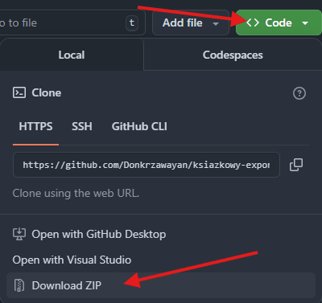
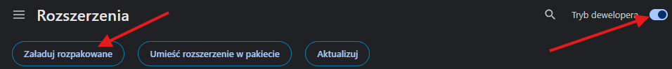
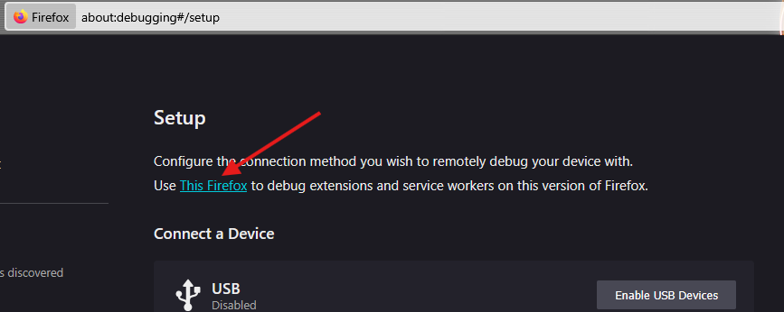
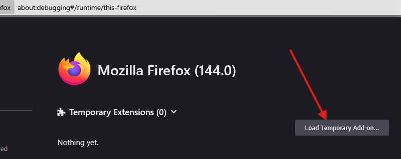

# Książkowy eksporter

Web browser extension for exporting read books from lubimyczytac.pl

Rozszerzenie do eksportowania biblioteki książek z serwisu lubimyczytac.pl. Wyeksportowany plik można następnie zaimportować na stronie [goodreads.com](https://www.goodreads.com/review/import)

## Korzystanie

1. Pobierz zip:  
  
Rozpakuj

### Chrome

2. Przejdź na stronę [chrome://extensions/](chrome://extensions/) (trzeba ręcznie skopiować link i wkleić do paska adresu), włącz tryb developera, kliknij "Załaduj rozpakowane" i wskaż folder wypakowania  

### Firefox

2.
   - Przejdź na stronę [about:debugging](about:debugging) (trzeba ręcznie skopiować link i wkleić do paska adresu) i kliknij "This Firefox"  
   

   - Kilknij "Load Temporary Add-on…" i wskaż dowolny plik w wypakowanym folderze  
   

3. Przejdź na stronę https://lubimyczytac.pl/biblioteczka i kliknij na rozszerzeniu  "Eksportuj bibliotekę do CSV"  

