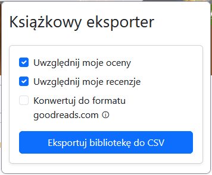

# Książkowy eksporter

Web browser extension for exporting read books from lubimyczytac.pl

Rozszerzenie do eksportowania biblioteki książek z serwisu lubimyczytac.pl. Wyeksportowany plik można następnie zaimportować na stronie [goodreads.com](https://www.goodreads.com/review/import)

### [Rozszerzenie Chrome](https://chromewebstore.google.com/detail/ksi%C4%85%C5%BCkowy-eksporter/dmkbllpoomkkhaknlclladonebiflhfa)

### [Rozszerzenie Firefox](https://addons.mozilla.org/pl/firefox/addon/ksi%C4%85%C5%BCkowy-eksporter/)



## Zgłaszanie problemów / Reporting Issues

Serwis *lubimyczytac* co jakiś czas aktualizuje swój kod i wygląd, co może spowodować błędy w eksporcie. Jeśli coś nie działa:  
**[Otwórz nowe zgłoszenie / Open a new Issue](../../issues/new/choose)** podając błędy z konsoli i kod HTML karty książki.

---

### Jak pobrać kod HTML karty książki? / How to get sample book HTML?
1. Otwórz konsolę deweloperską / Open DevTools (`F12` -> zakładka *Console*).
2. Wklej poniższą linijkę w konsoli przeglądarki na stronie biblioteczki i wciśnij Enter (kod HTML zostanie skopiowany do schowka) (może nie działać jeśli wygląd strony się zmienił):

```javascript
copy(document.querySelector('.book-card, [id^="listBookElement"]')?.outerHTML)
```

**Uwaga:** Przed wklejeniem do zgłoszenia przejrzyj treść i usuń dane prywatne, których nie chcesz upubliczniać (np. prywatne notatki / oceny).
